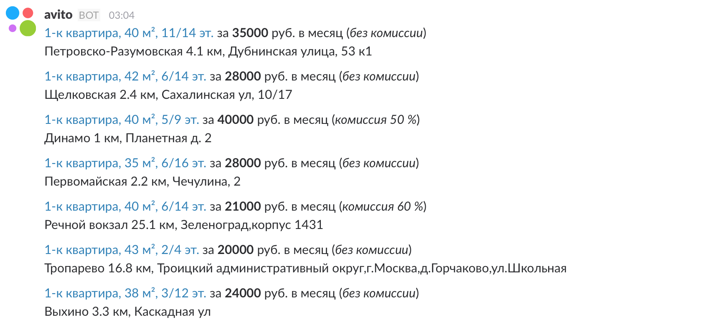

# Avito Realty Notifier

Avito Realty Notifier создан на кодовой базе https://github.com/Lexty/avito-notifier. Люто плюсуем @Lexty за это :)

Avito Realty Notifier — это кастомная Slack-интеграция для уведомления в канал о новых объявлениях недвижимости (продажа/аренда, частная/коммерческая и т.д.).

Для подготовки к запуску потребуется сделать следующее:

1) Получить ссылку с листингом объявлений ([пример](https://www.avito.ru/moskva/kvartiry/sdam/na_dlitelnyy_srok/1-komnatnye?bt=0&pmax=50000)).
2) Добавить и настроить [Incoming WebHook](https://strsqr.slack.com/apps/new/A0F7XDUAZ-incoming-webhooks) интеграцию в канал.

Далее запускаем скрипт с параметрами:

`go run main.go -s "https://www.avito.ru/moskva/kvartiry/sdam/na_dlitelnyy_srok/1-komnatnye?bt=0&pmax=50000" -w "https://hooks.slack.com/services/XXXXXXXXX/YYYYYYYYY/wowitsrandomguid"`

или же предварительно собраем приложение и после уже запускаем:

`go build main.go`

`./main -s "https://www.avito.ru/moskva/kvartiry/sdam/na_dlitelnyy_srok/1-komnatnye?bt=0&pmax=50000" -w "https://hooks.slack.com/services/XXXXXXXXX/YYYYYYYYY/wowitsrandomguid"`

В результате, в вашем Slack-канале вы найдете следующее:

Чтобы не искать логотип Avito для бота, его можно найти в репозитории:

## TODO:

- [ ] Нужно больше информации и аттачменты!
- [ ] Рефакторинг и оптимизация кода
- [ ] Возможность уведомлять не только о недвижимости
